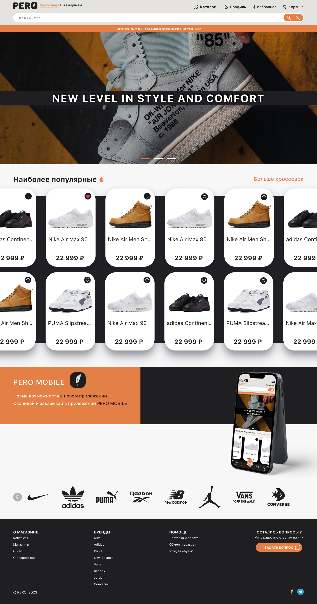

# Интернет-магазин кроссовок PERO

Данный сайт представляет собой интернет-магазин по продаже обуви. На сайте Вы можете просмотреть каталог товаров, добавить некоторые из них в избранное, совершить покупку и создать личный кабинет.

Сайт полностью адаптивный и кроссбраузерный. На сайте присутствует навигация, фильтрация, поиск товаров, реализованы корзина и избранное, есть возможность регистрации/входа в личный кабинет, реализована связь с бэкендом.

## Разработчики:
- Front-End dev. and Design Misha Chernov (me)
- Back-End dev. and DevOps [Rustam Khudoyan](https://github.com/h0riz4n)

## Стек технологий:
- ReactJS
- SCSS
- React-Router-DOM
- React Content Loader
- React Slick
- React Intersection Observer
- Axios/Fetch API

## Скриншоты сайта:
- Главная страница

- Каталог

- Страница товара

- Корзина

- Профиль

- Избранное
